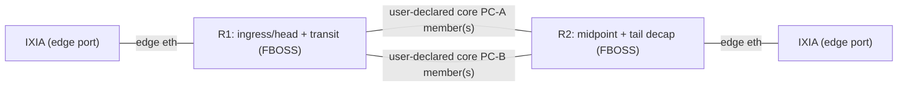

# RBB SRv6 Test — Adopt & Run Guide

A two-node **SRv6** test for FBOSS switches. It checks that R1 encapsulates
traffic into an SRv6 core, R2 decapsulates it at the tail, and a direct
`TE_AGENT` route can take over and hand back to BGP — optionally sending real
IXIA traffic end to end.

The committed code has **no lab-specific values**. One initialization command
creates four adopter-owned files from redacted templates in an ignored local
directory. Unit tests run anywhere; a live run needs real switches.

---

## Quick start (no hardware)

Just want to see the tests pass? Build the image and run the unit tests:

```bash
./scripts/validate.sh --skip-smoke -- \
  taac/playbooks/routing/tests/test_rbb_*.py \
  taac/runner/tests/test_rbb_preflight.py
```

That's it — no switches and no IXIA are contacted. Explicit paths prevent
unrelated, Meta-only test modules elsewhere in the repository from being
collected before pytest can apply a name filter.

---

## Adopt in 3 inputs

To run against **your** lab, you provide three things:

| # | Input | What it is |
| --- | --- | --- |
| 1 | `device_info.csv` | your two switches (hostname + `FBOSS`) |
| 2 | `circuit_info.csv` | how they're wired (core port-channels + IXIA edges) |
| 3 | local settings | SRv6 plan plus DUT and IXIA credentials |

The bundled templates are:

- [`topology/rbb_device_info.csv`](topology/rbb_device_info.csv)
- [`topology/rbb_circuit_info.csv`](topology/rbb_circuit_info.csv)
- [`rbb_srv6_profile.env.example`](rbb_srv6_profile.env.example)
- [`taac_secrets.json.example`](taac_secrets.json.example)

**1. `device_info.csv`** — only `hostname` and `operating_system` matter:

```
# hostname,ipv6_address,ipv4_address,mac_address,role,operating_system,hardware
<r1-host>,,,,RBB,FBOSS,<hardware-name>
<r2-host>,,,,RBB,FBOSS,<hardware-name>
```

**2. `circuit_info.csv`** — one row per link. This is the source of truth for
core port-channels (rows where both ends are DUTs and a `local_parent_interface`
is set) and the IXIA edges (rows with `role=IXIA`, where the DUT interface maps
to an IXIA `slot/port` like `1/3`):

```
hostname,local_interface,local_platform,local_parent_interface,neighbor_hostname,neighbor_interface,neighbor_platform,neighbor_parent_interface,status,role
```

Initialize the checkout-local `.taac/` directory once. Git and Docker builds
both exclude this directory by default, protecting populated credentials and
lab details from accidental commits or image builds:

```bash
./scripts/run-rbb-srv6.sh --init
```

The command creates `.taac/` as mode `700`, creates `secrets.json` as mode
`600`, and never replaces an existing file. Edit `device_info.csv`,
`circuit_info.csv`, and `rbb.env` for the lab. When both DUTs use the same SSH
credentials, fill `secrets.json` with the shared DUT credentials and the
IxNetwork API-server credentials:

```json
{
  "version": 1,
  "dut": {"username": "admin", "password": "your-dut-password"},
  "ixia": {"username": "admin", "password": "your-ixia-password"}
}
```

When DUT credentials differ, add entries under `dut.hosts`. Each key must match
the corresponding `TAAC_RBB_R1_HOST` or `TAAC_RBB_R2_HOST` value (DNS matching
is case-insensitive and ignores one trailing dot):

```json
{
  "version": 1,
  "dut": {
    "username": "",
    "password": "",
    "hosts": {
      "rbb-r1.lab.example": {
        "username": "r1-admin",
        "password": "your-r1-password"
      },
      "rbb-r2.lab.example": {
        "username": "r2-admin",
        "password": "your-r2-password"
      }
    }
  },
  "ixia": {"username": "admin", "password": "your-ixia-password"}
}
```

Host entries may override only one field and inherit the other from the shared
`dut` entry. Explicit `TAAC_SSH_*` environment variables override both shared
and per-host file values for a deliberate one-run override.

The runner accepts this file through `--secrets-file`, validates its schema and
`chmod 600` permissions, mounts the local input directory read-only in the
container, and never logs secret values. Existing `TAAC_SSH_*` or `TAAC_IXIA_*`
environment variables take precedence as deliberate one-run overrides. The
committed JSON file is an empty template only; never put a real credential
under `examples/`.

To keep deployment data outside the checkout, initialize and use an explicit
external directory. The runner resolves it to an absolute path and mounts it
read-only at the same container location; users do not need to construct Docker
volume arguments:

```bash
./scripts/run-rbb-srv6.sh --config-dir /secure/rbb-lab --init
./scripts/run-rbb-srv6.sh --config-dir /secure/rbb-lab --check
./scripts/run-rbb-srv6.sh --config-dir /secure/rbb-lab
```

Within the DNE-TaaC checkout, configuration directories must be `.taac/` or a
child of it so Git's committed ignore rule always covers `secrets.json`.

The suite has a complete documentation-range address plan, so constructing the
configuration or running a dry run does not require address variables. A live
lab must either be configured with that plan or override it to match the DUTs.

### Default SRv6 address plan

| Purpose | Default | Override |
| --- | --- | --- |
| SRv6 locator | `2001:db8:6::/48` | `TAAC_RBB_SRV6_LOCATOR` |
| R1 head uSID | `2001:db8:6:27cc::` | `TAAC_RBB_SRV6_USID_HEAD` |
| R2 midpoint uSID | `2001:db8:6:27d6::` | `TAAC_RBB_SRV6_USID_MID` |
| R2 tail/decap uSID | `2001:db8:6:7fff::` | `TAAC_RBB_SRV6_USID_TAIL` |
| Effective decap SID | tail uSID | `TAAC_RBB_SRV6_DECAP_SID` |
| R1/R2 router IDs | `192.0.2.1` / `192.0.2.2` | `TAAC_RBB_R1_ROUTER_ID` / `_R2_...` |
| R1/R2 IPv6 loopbacks | `2001:db8:0:1::1` / `2001:db8:0:2::1` | `TAAC_RBB_R1_LOOPBACK_V6` / `_R2_...` |
| Core PC 0 | `198.51.100.0/30`, `2001:db8:c0::/127` | `TAAC_RBB_R{1,2}_CORE0_V{4,6}` |
| Core PC 1 | `198.51.100.4/30`, `2001:db8:c1::/127` | `TAAC_RBB_R{1,2}_CORE1_V{4,6}` |
| Inner destination pool | `2001:db8:beef::/64` | `TAAC_RBB_IXIA_TAIL_PREFIX` + `_LEN` |
| TE_AGENT destination | `2001:db8:beef::/64` | `TAAC_RBB_TAIL_PREFIX` |
| R1 IXIA link / gateway | `2001:db8:a:3::2/64` / `2001:db8:a:3::1` | `TAAC_RBB_IXIA_R1_EDGE_V6` / `_GW_V6` |
| R2 IXIA link / gateway | `2001:db8:a:10::2/64` / `2001:db8:a:10::1` | `TAAC_RBB_IXIA_R2_EDGE_V6` / `_GW_V6` |

When only `TAAC_RBB_SRV6_LOCATOR` changes in `.taac/rbb.env`, TAAC automatically
derives the head, midpoint, and tail functions (`27cc`, `27d6`, and `7fff`)
inside the new locator. Add the three `TAAC_RBB_SRV6_USID_*` settings only when
the deployed function values differ:

```text
# Simplest customization: retain the default function IDs in a new locator.
TAAC_RBB_SRV6_LOCATOR=<your-locator>

# Optional: replace the logical head -> midpoint -> tail SID plan.
TAAC_RBB_SRV6_USID_HEAD=<r1-head-sid>
TAAC_RBB_SRV6_USID_MID=<r2-midpoint-sid>
TAAC_RBB_SRV6_USID_TAIL=<r2-tail-sid>

# Keep the steered prefix identical to the one IXIA advertises.
TAAC_RBB_IXIA_TAIL_PREFIX=<inner-destination-network>
TAAC_RBB_IXIA_TAIL_PREFIX_LEN=64
TAAC_RBB_IXIA_TAIL_PREFIX_COUNT=1
TAAC_RBB_TAIL_PREFIX=<inner-destination-network>/64
```

All committed addresses are from the IPv6 documentation block and are not
operator allocations. The complete set of optional knobs, including loopbacks
and traffic parameters, is in
`taac/testconfigs/routing/util/bgp_rbb_constants.py`.

If the device inventory service cannot identify the boxes, set
`TAAC_RBB_R1_HARDWARE` and `TAAC_RBB_R2_HARDWARE` to the corresponding inventory
hardware labels.

Port and IXIA numbers are not fixed. Declare every available connection in the
CSV. This two-port traffic model selects the first IXIA edge for each DUT unless
you set `TAAC_RBB_R1_IXIA_INTERFACE` and/or
`TAAC_RBB_R2_IXIA_INTERFACE`. Only the selected pair is reserved or changed;
the other declared links remain available to other tests.

`TAAC_RBB_R{1,2}_CORE<n>_V4` and `_V6` map to those core port-channels in CSV
order. Keep the documentation-range defaults for a fresh isolated bootstrap,
or replace them with the RIF addresses already configured on each DUT when
using the preconfigured workflow. S10 checks the selected core member for that
exact IPv6 address by default; platforms with a different display contract may
set `TAAC_RBB_PC162_RIF_TOKEN` to an address token from that interface. A LAG
name alone is not accepted as RIF evidence.

---

## Run it

Build the TAAC image once before checking or running the hardware workflow:

```bash
./docker/build-taac-image.sh --num-jobs 2
```

Validate all local inputs before contacting the lab:

```bash
./scripts/run-rbb-srv6.sh --check
```

This checks the secrets schema and permissions, required settings, DUT rows,
CSV shape, topology relationships, placeholder endpoints, and—when
`--with-traffic` is present—the IXIA credentials, controller/chassis, ports,
and advertised-prefix contract. It runs inside the already-built TAAC image but
does not contact a DUT or reserve IXIA. The same preflight runs automatically
inside the single container used for every real run; Docker remains the only
host-side dependency.

### Case 1: freshly installed FBOSS image

Use this when the DUT has the stock, hardware-valid FBOSS AgentConfig and the
image's placeholder `bgp.json`, `policy.json`, and `openr.conf`, but no RBB
ports, OpenR adjacency, iBGP session, or SRv6 state:

```bash
./scripts/run-rbb-srv6.sh --check --setup-duts
./scripts/run-rbb-srv6.sh --setup-duts
```

`--setup-duts` temporarily enables only the core members selected by
`circuit_info.csv`, reuses each selected port's existing ingress VLAN/RIF, and
adds the loopbacks, OpenR, one loopback iBGP peer, and SRv6 MySID/tunnel/routes.
Core and IXIA-edge interface names must use the exact spelling present in the
installed AgentConfig.
It never generates or changes the image's platform block, port inventory,
speed, profile, queue, or switch settings. The generated `sw` object is checked
against the TAAC image's FBOSS Thrift schema, and generated BGP is checked
against its bundled schema, before the first DUT write. After both nodes are
applied, setup waits up to 120 seconds for the selected core links and loopback
iBGP session to converge before any validation step runs. Because the workflow
writes system configuration and controls services directly, the DUT credential
used with `--setup-duts` must open a root SSH session.
It also fails before that write if a selected RIF already has addresses, its
port or aggregate is already claimed by an aggregate, the placeholder BGP file
already has peers or networks, the BGP/OpenR placeholder identity was replaced,
or an RBB-owned logical ID already exists. A stock port that is administratively
enabled but otherwise unconfigured is supported. In any rejected situation,
use the preconfigured Case 2 workflow;
`--setup-duts` is intentionally restricted to the stock fresh-image baseline.

The fboss-buildimage defaults are `/etc/coop/agent.conf`,
`/opt/openr/openr.conf`, `/opt/bgpd/bgp.json`, and `/opt/bgpd/policy.json`;
recovery state is kept at `/var/tmp/taac-rbb-bootstrap-state.json`. An OSS image
with another layout may override these with `TAAC_RBB_AGENT_CONFIG_PATH`,
`TAAC_RBB_OPENR_CONFIG_PATH`, `TAAC_RBB_BGP_CONFIG_PATH`,
`TAAC_RBB_BGP_POLICY_PATH`, and `TAAC_RBB_BOOTSTRAP_STATE_PATH` in `rbb.env`.
Preflight requires distinct, canonical absolute paths and rejects shell-active
or TAAC-reserved artifact names. On the DUT, each source configuration must be
a regular, non-symlink file so snapshot and ownership restoration are exact.

For a complete fresh-image IXIA run, also request the independent DUT-edge
overlay. The runner rejects this mode without `--setup-dut-edges`, because a
fresh placeholder BGP configuration has no IXIA-facing peer from which the
tail route can be learned:

```bash
./scripts/run-rbb-srv6.sh --check --setup-duts --with-traffic --setup-dut-edges
./scripts/run-rbb-srv6.sh --setup-duts --with-traffic --setup-dut-edges
```

The bootstrap is deliberately temporary. TAAC records the original service
active/inactive states, file modes, and numeric owners; snapshots the exact
contents of the three changed files; and restores them during teardown even
after setup/test failure. It does not persistently enable a service that the
image shipped disabled. Recovery artifacts are retained if an
interruption or failed restore prevents exact rollback.

The initial OSS bootstrap supports exactly one physical member per core
port-channel. Read-only validation still supports wider LAGs, but bootstrap
preflight rejects them rather than inventing a shared-VLAN model that may be
wrong for another FBOSS platform. Port-channel names must be
`port-channel<N>` so the required FBOSS aggregate key is unambiguous.

### Case 2: complete configuration is already present

### Default: device-path only, no IXIA reservation

```bash
./scripts/run-rbb-srv6.sh
```

Expected: the applicable `S02–S28` gates PASS and the process exits 0. TC1
temporarily installs a `TE_AGENT` route on R1. It retains the existing BGPD
route's original recursive next hop (the tail decap SID) and adds an explicit
FBOSS `srv6SegmentList` containing the packed remote midpoint + tail uSIDs. The
head uSID is not repeated on the wire because R1 is already the encapsulating
headend. Its cleanup step withdraws only that route even when a later stage
fails. This mode still
contacts both DUTs and requires the tail prefix to be present on R1 as a
BGPD-owned route; it simply avoids reserving or configuring IXIA.

### With live IXIA traffic

Set `TAAC_RBB_IXIA_CHASSIS` (the physical chassis IP) and
`TAAC_IXIA_API_SERVER` (the IxNetwork controller) in `.taac/rbb.env`, fill the
IXIA credentials in `.taac/secrets.json`, and enable traffic explicitly:

```bash
./scripts/run-rbb-srv6.sh --check --with-traffic
./scripts/run-rbb-srv6.sh --with-traffic
```

IXIA sends the inner IPv6 flow into R1; the explicit TE_AGENT segment list
makes R1 perform SRv6 encapsulation, and the test verifies receipt at the tail.
If the selected IXIA-facing DUT interfaces are not already configured, use
`./scripts/run-rbb-srv6.sh --with-traffic --setup-dut-edges`. Leave that option
off when the lab owns the edge configuration permanently. Because this option
temporarily writes the selected AgentConfig RIF and BGP neighbor, it also
requires a root DUT SSH credential; preflight rejects a non-root credential
before contacting either DUT. The FBOSS agent and BGP services must already be
loaded and active; use `--setup-duts` as well when starting from a fresh image.

For TC1, `TAAC_RBB_TAIL_PREFIX` must equal the single prefix advertised by
`TAAC_RBB_IXIA_TAIL_PREFIX`/`TAAC_RBB_IXIA_TAIL_PREFIX_LEN`, and
`TAAC_RBB_IXIA_TAIL_PREFIX_COUNT` must be `1`. The factory rejects a mismatched
route/traffic contract before reserving the chassis.

TAAC's existing global IXIA advertisement allowlist stays enabled by default.
If an isolated lab uses an explicitly owned prefix outside that allowlist, set
`TAAC_RBB_SKIP_ADVERTISED_PREFIXES_CHECK=1` in `rbb.env`. This opt-out applies
only to the RBB TestConfig; preflight and the factory still restrict IXIA to
the single exact IPv6 prefix above.

---

## What it tests



- **R1** encapsulates into the SRv6 core; **R2** decapsulates at the tail.
- Verifies the SRv6 my-SID table and core interface addresses.
- Exercises the `TE_AGENT` direct-route lifecycle: install → owner becomes
  `TE_AGENT` → withdraw → reverts to `BGPD`.
- With traffic enabled, confirms packets are received at the tail.

The scenario defines a logical head → midpoint → tail chain. Because
encapsulation happens at R1, the on-wire container starts at the R2 midpoint
and ends at the R2 tail; the midpoint adjacency sends the packet back through
R1 as transit before the tail SID returns it to R2 for decapsulation. The first
and last user-declared core port-channels provide the physical directions used
by that two-node emulation (the same bundle may serve both when only one is
declared); their interface numbers are not fixed.

`bgp_rbb_srv6_3_usids` sends one IPv6 traffic item from R1 to R2. This is the
direction in which R1 installs the SRv6 segment-list route and R2 decapsulates;
ordinary reverse IPv6 traffic is intentionally outside this qualification.

---

## Device configuration ownership

By default, the onboarding guide's static lab configuration remains an external
input: TAAC validates the existing core port-channels, IPv6/OpenR underlay,
iBGP, SRv6 uSIDs, and IXIA-facing VLAN interfaces without replacing them.
`--setup-duts` is the explicit Case 1 exception for a stock fresh image. It
patches the installed hardware baseline instead of generating a switch config
from scratch, and restores the original baseline at teardown.

Some labs leave only the selected IXIA edge disabled or unaddressed. For that
narrow case, pass `--setup-dut-edges` to the runner. Setup minimally patches
the existing `/etc/coop/agent.conf` and `/opt/bgpd/bgp.json` with the selected
IPv6 edge RIF,
eBGP neighbor, and iBGP IPv6 AFI settings. It snapshots the exact originals as
`<path>.taac-rbb-edge-orig`, validates every write, and restores and consumes
the snapshots during teardown. A stale snapshot blocks mutation so an
interrupted run cannot silently overwrite its recovery point.

For the traffic qualification, set `TAAC_RBB_ENCAP_COUNTER_CMD` / `_REGEX` and
`TAAC_RBB_DECAP_COUNTER_CMD` / `_REGEX` to counters that identify the actual
SRv6 encap and decap objects on your platform. The portable defaults are useful
path counters, but they do not by themselves distinguish SRv6 traffic from
ordinary IPv6 forwarding.

---

## Troubleshooting

| Symptom | Fix |
| --- | --- |
| Local configuration files are missing | Run `./scripts/run-rbb-srv6.sh --init`; it will not replace files that already exist. |
| Secrets file permissions are rejected | Run `chmod 600 .taac/secrets.json` (or use the equivalent file under `--config-dir`). |
| Live mode reports placeholder wiring | Replace the placeholder rows in the selected `circuit_info.csv`; traffic requires adopter-supplied wiring. |
| More than one IXIA edge is declared | Select one with `TAAC_RBB_R1_IXIA_INTERFACE` / `TAAC_RBB_R2_IXIA_INTERFACE`. |
| TC1 reports tail-prefix contract mismatch | Make `TAAC_RBB_TAIL_PREFIX` equal the one advertised IXIA tail prefix and set its count to `1`. |
| IXIA rejects a lab-owned advertised prefix | Prefer an allowlisted lab range. In an isolated lab, explicitly set `TAAC_RBB_SKIP_ADVERTISED_PREFIXES_CHECK=1`; TC1 still limits the generated pool to one exact IPv6 prefix. |
| R1 edge-eBGP setup reports no usable IPv6 `next_hop6` | Set `TAAC_RBB_R1_IBGP_NEXT_HOP_V6` to an underlay-routable R1 IPv6 address; otherwise the existing usable value is preserved. |
| A `.taac-rbb-edge-orig` snapshot already exists | Treat it as an interrupted-run recovery point; inspect or restore it before retrying. |
| Edge setup cannot find the required base JSON config | Configure the DUT underlay and SRv6 base state before running the qualification. |
| Fresh-image setup reports a nonnumeric or multi-member core LAG | For the first bootstrap implementation, use `port-channel<N>` with one physical member per core LAG; preconfigure wider LAGs and run without `--setup-duts`. |
| A `.taac-rbb-bootstrap-orig` snapshot or bootstrap state file exists | Treat it as an interrupted-run recovery point. Do not delete or overwrite it until the original files/service state have been inspected or restored. |
| IXIA `test port hosts ... are not in a ready state` | `TAAC_RBB_IXIA_CHASSIS` must be the **physical chassis** IP, not the IxNetwork API server. |
| `Ixia password ... does not contain a valid password` | Fill `ixia.password` in `.taac/secrets.json`, or inject `TAAC_IXIA_PASSWORD` from a secret manager. |
| Config builds but nothing runs live | Make sure the CSVs describe your fleet and `--dut` values match the hostnames. |

---

## Reference

- Build / image / driver docs: [`../README.md`](../README.md),
  [`../docker/README.md`](../docker/README.md)
- All `TAAC_RBB_*` env vars (with defaults):
  `taac/testconfigs/routing/util/bgp_rbb_constants.py`
- Suite internals are documented in the module docstrings under
  `taac/tasks/`, `taac/testconfigs/routing/util/`, and the `qual_rbb/` factories.
